# Coursera Certificates

## [JavaScript for Beginners Specialization](https://www.coursera.org/specializations/javascript-beginner)
[Certificate link](https://coursera.org/share/a48d0ffa9e9ec88c49d44d4a42ff00f0)
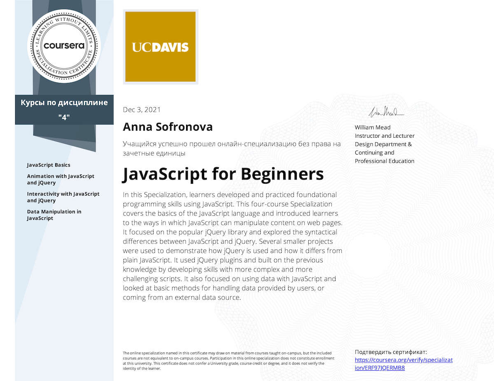

1. [JavaScript Basics](https://www.coursera.org/learn/javascript-basics?specialization=javascript-beginner)  
[Certificate link](https://coursera.org/share/ed366868d84df74f5454d28570c28001)
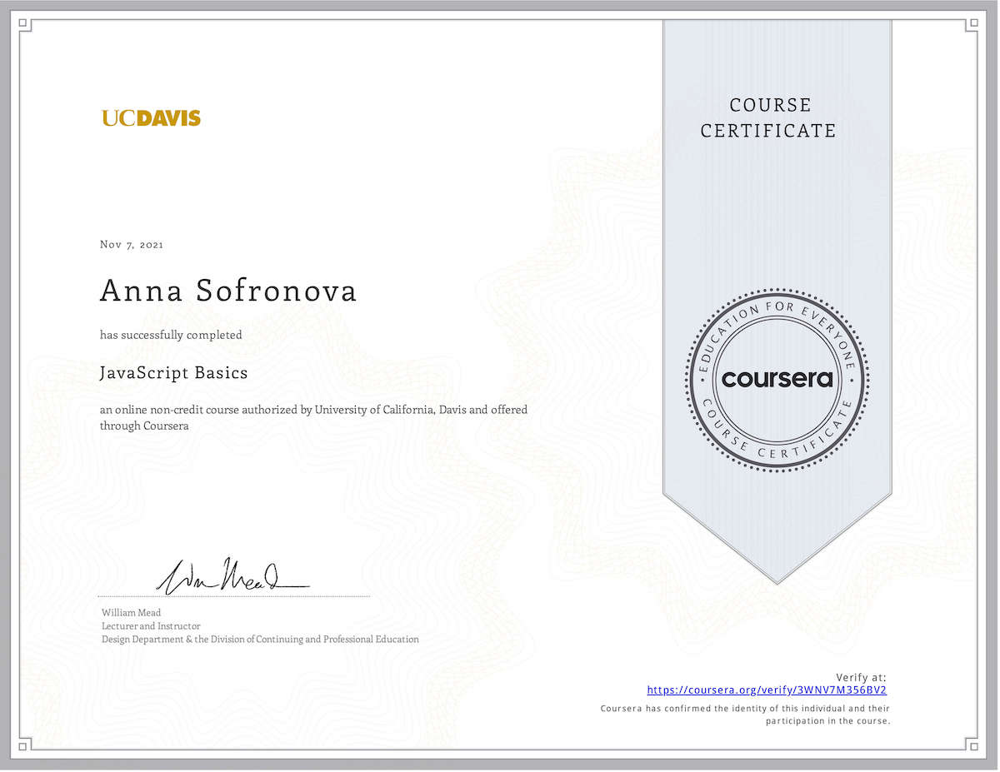

2. [Animation with JavaScript and jQuery](https://www.coursera.org/learn/animation-javascript-jquery?specialization=javascript-beginner)  
[Certificate link](https://coursera.org/share/a6403e7d1c7db3588d2d72cbc2430366)
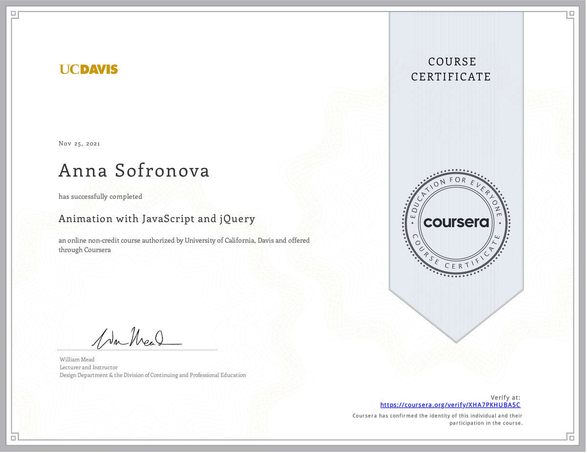

3. [Interactivity with JavaScript and jQuery](https://www.coursera.org/learn/interactivity-javascript-jquery?specialization=javascript-beginner)  
[Certificate link](https://coursera.org/share/e2301fd5fe71d9b803dd439de0b6e809)

4. [Data Manipulation in JavaScript](https://www.coursera.org/learn/javascript-data-manipulation?specialization=javascript-beginner)  
[Certificate link](https://coursera.org/share/722538a05550ce98bb61c4e86c8b7120)
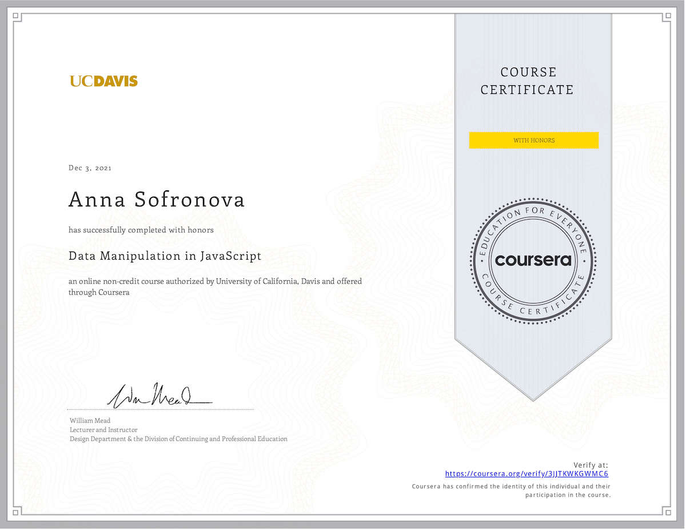

## [HTML, CSS, and Javascript for Web Developers](https://www.coursera.org/learn/html-css-javascript-for-web-developers)
[Certificate link](https://coursera.org/share/416467096ab7a722b59cd11088dec38e)
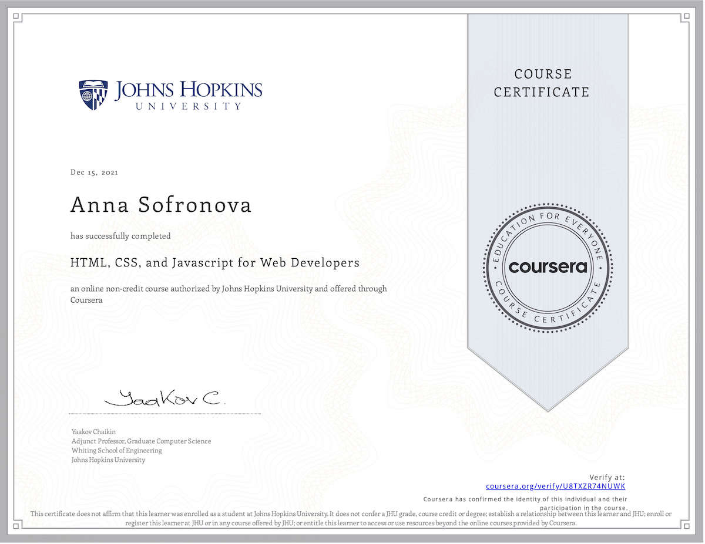

## [Web Design for Everybody: Basics of Web Development & Coding Specialization](https://www.coursera.org/specializations/web-design)  

1. [Introduction to HTML5](https://www.coursera.org/learn/html?specialization=web-design)  
[Certificate link](https://coursera.org/share/fe526ce566f9634f952502956d7d80ab)
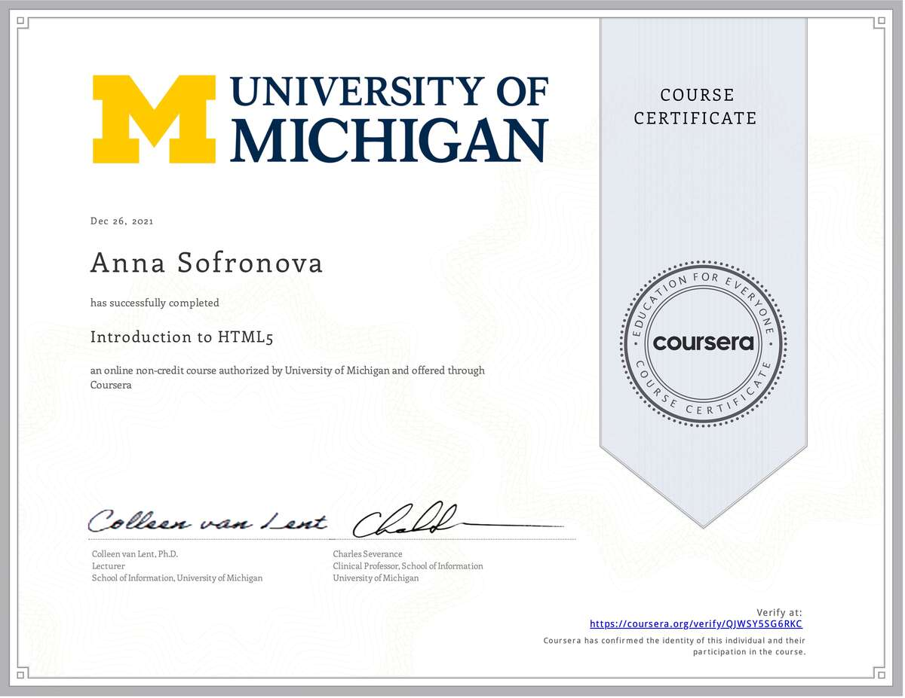

2. [Introduction to CSS3](https://www.coursera.org/learn/introcss?specialization=web-design)  
[Certificate link](https://coursera.org/share/1e92a79fa6a48b6ff2c6f1b99aafdb0e)
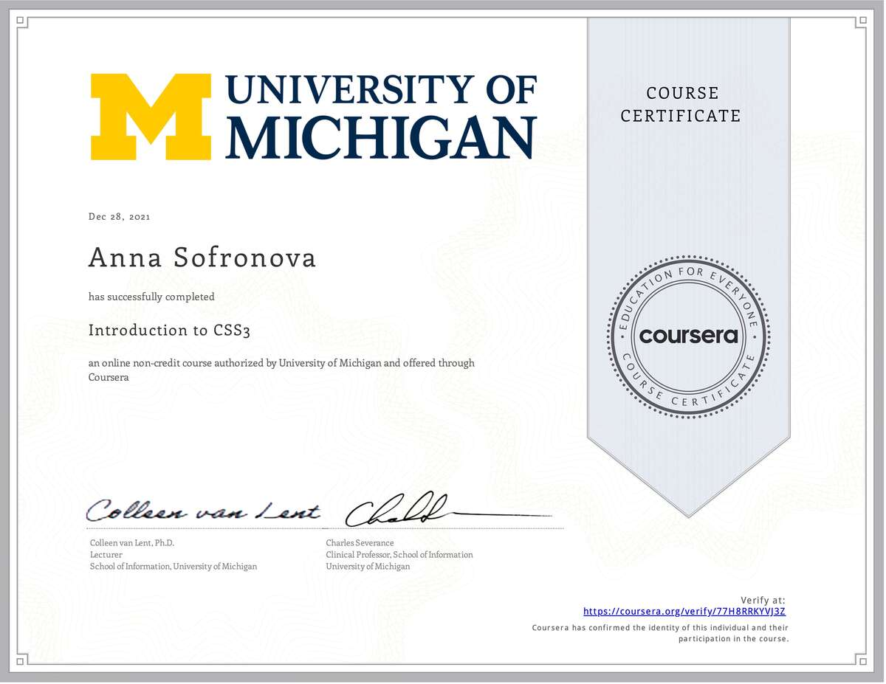

## [Специализация Разработка интерфейсов: вёрстка и JavaScript](https://www.coursera.org/specializations/razrabotka-interfeysov)  

1. [Основы HTML и CSS](https://www.coursera.org/learn/snovy-html-i-css?specialization=razrabotka-interfeysov)  
[Certificate link](https://coursera.org/share/da0b602e37d092703bb06e461308d03f)
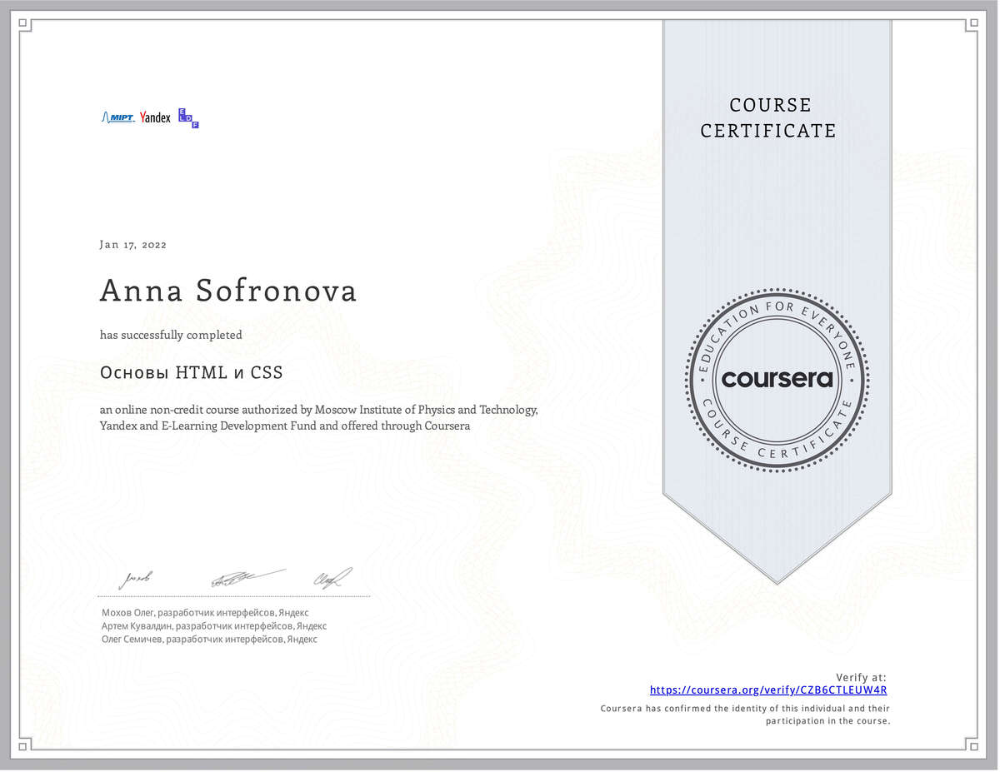

2. [Тонкости верстки](https://www.coursera.org/learn/tonkosti-verstki?specialization=razrabotka-interfeysov)  
[Certificate link](https://coursera.org/share/6d086e3a0952323b7251bd0817a2166d)
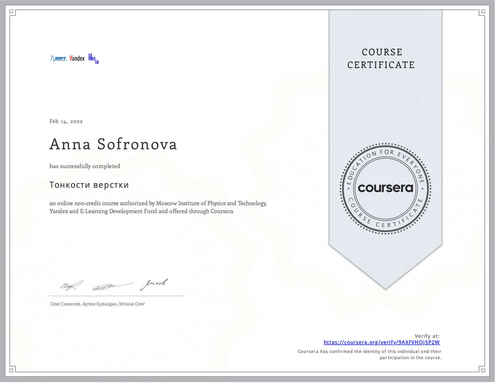

3. [JavaScript, часть 1: основы и функции](https://www.coursera.org/learn/javascript-osnovy-i-funktsii?specialization=razrabotka-interfeysov)  
[Certificate link](https://coursera.org/share/2b51b1e8b89cc979c975bc04921d81ff)
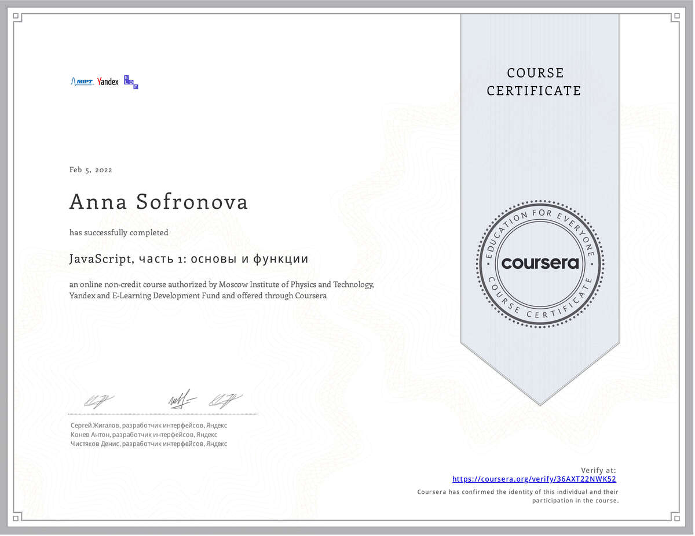

4. [JavaScript, часть 2: прототипы и асинхронность](https://www.coursera.org/learn/javascript-prototipy?specialization=razrabotka-interfeysov)   
[Certificate link](https://coursera.org/share/61813789f532cf948a73a6bd1e4e83dc)
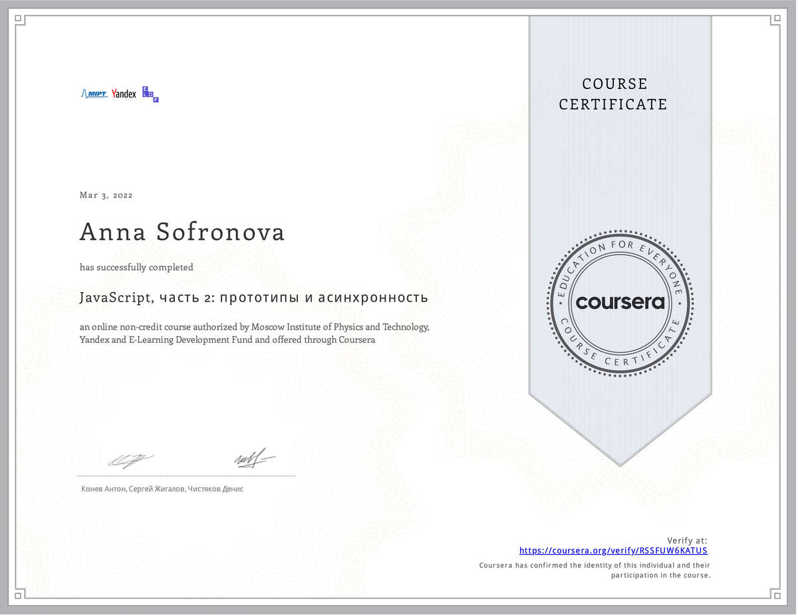